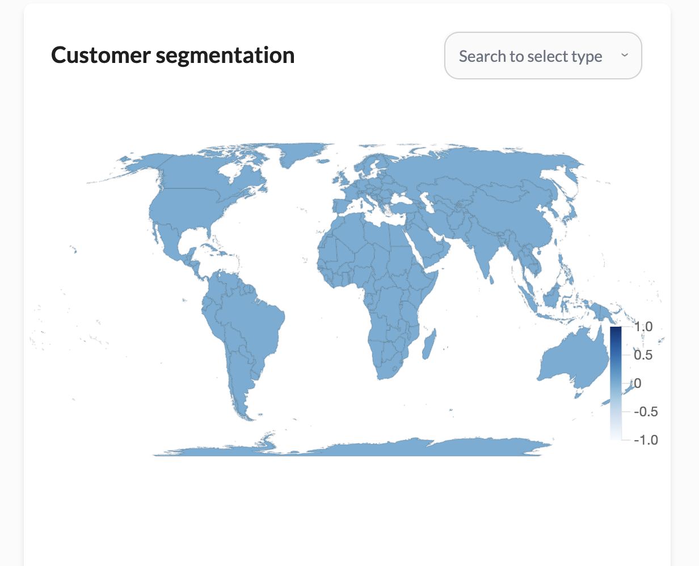

# Customer Segmentation

Geographic Distribution: A world map highlighting the distribution of your customers. This feature allows you to visualize where your customers are located globally, helping you tailor your marketing strategies to different regions.

