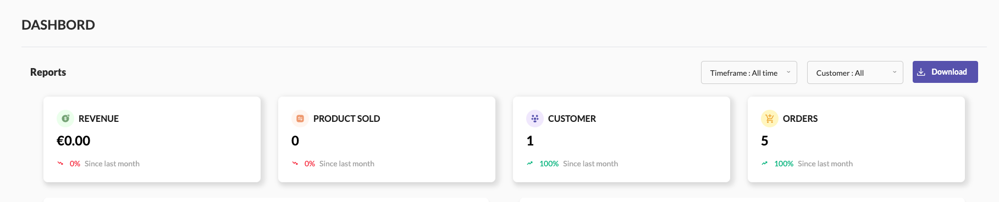

# Reports Overview

- **Revenue:** Displays your total revenue. The figure updates in real-time and includes a percentage change since the last month.
- **Product Sold:** Shows the total number of products sold. It also indicates the percentage change compared to the previous month.
- **Customer:** Tracks the number of new customers acquired, with a month-over-month comparison.
- **Orders:** Displays the total number of orders placed, along with the percentage change since last month.

