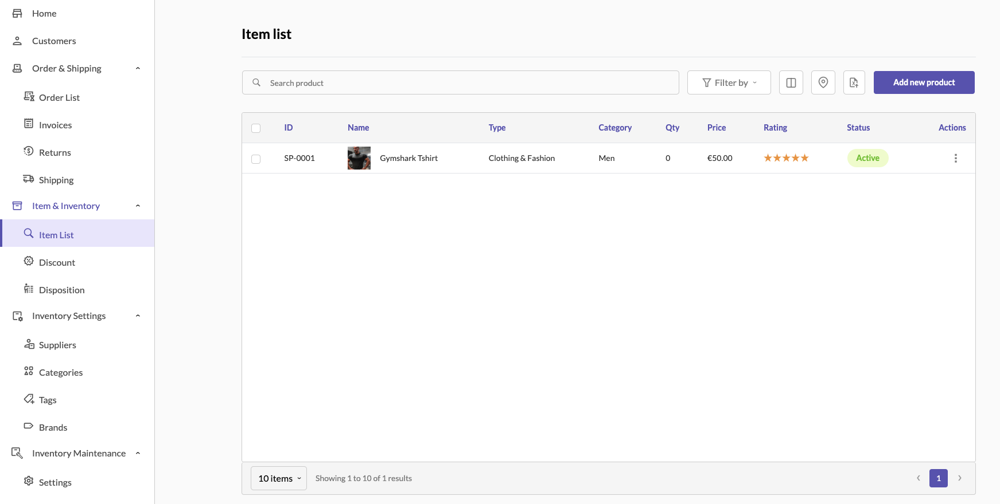
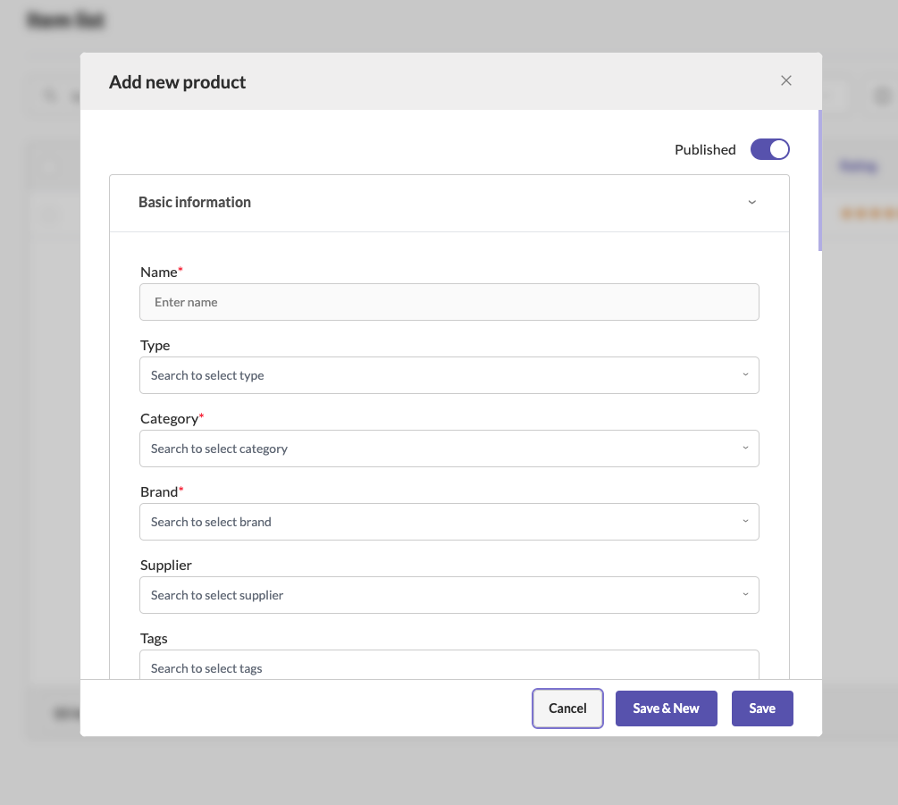
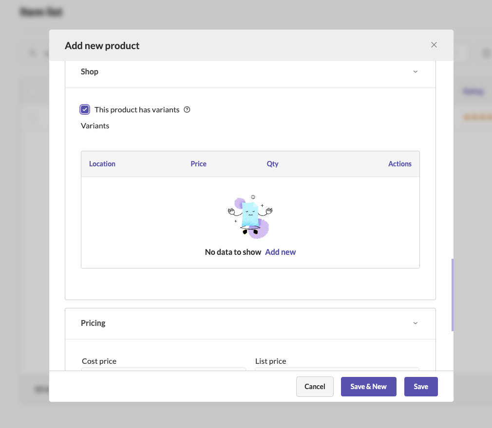

# Products

### Understanding Products

> Products are the cornerstone of any ecommerce business. They represent the items or services that your shop offers to customers. Effective product management is crucial for ensuring that your store operates smoothly, your inventory is well organized, and your customers can easily find what they are looking for. In Sellista, the product management system is designed to make it easy to add, edit, and organize products, providing a seamless experience for both shop owners and customers.

## Adding a New Product

Adding new products to your Sellista store is a straightforward process, allowing you to input detailed information to ensure each product is well represented and easy to find. Here’s a step-by-step guide on how to add a new product:

### 1. Access the Product List

    - Navigate to the **Shop** section in the Sellista dashboard.
    - Select **Item & Inventory** and then **Item List** to view your product list.

### 2. Add New Product

    - Click the **Add new product** button located at the top right corner of the product list page.

### 3. Enter Basic Information

    - **Name:** Enter the product name. This is a required field.
    - **Type:** Select the type of product from the dropdown menu.
    - **Category:** Choose the appropriate category for your product. This helps in organizing products and making them easier to find.
    - **Brand:** Select the brand of the product, if applicable.

### 4. Provide Detailed Information

    - **Supplier:** Choose the supplier from the dropdown menu.
    - **Tags:** Add relevant tags to help categorize and search for the product.
    - **Description:** Enter a detailed description of the product. Use the formatting tools to enhance the text with bold, italics, lists, links, and images.
    - **Notes:** Add any internal notes that might be useful for managing the product.

### 5. Upload Media

    - **Import Images:** Drag and drop images of the product or browse your files to upload. Accepted formats include JPEG, PNG, and JPG, with a recommended size of 1024x1024 pixels.

### 6. Set Identifiers

    - **ID:** Automatically generated product ID.
    - **UPC:** Enter the Universal Product Code, if available.
    - **EAN:** Enter the European Article Number, if applicable.
    - **SKU:** Enter the Stock Keeping Unit for inventory tracking.

### 7. Define Pricing

    - **Cost Price:** Enter the cost price of the product.
    - **List Price:** Set the list price for customers.
    - **Default Price:** Specify the default selling price.
    - **Margin and Profit:** These fields will auto-calculate based on the cost price and list price.
    - **Apply Discount:** Check this option if you want to apply a discount to the product.
    - **Apply Tax:** Enable this option to apply tax to the product price.

### 8. Configure Search Engine Listing

    - **Page Title:** Enter a title for the product page, optimized for search engines.
    - **Meta Description:** Write a meta description to improve SEO and provide a summary of the product.
    - **URL Handle:** Define a URL handle for the product page, which should be SEO-friendly.

### 9. Physical Product Details

    - **Location:** Select the storage location of the product.
    - **Quantity:** Enter the quantity of the product available.
    - **Unit:** Specify the unit of measurement.
    - **Weight:** Enter the weight of the product.
    - **Dimensions:** Provide the width, height, and length of the product.

### 10. Finalize and Save

    - Once all required and optional fields are filled, click **Save** to add the product to your inventory.
    - You can also choose **Save & New** if you want to add another product immediately after.

## Adding Product Variants

Product variants are different versions of a product that vary in attributes such as size, color, or material. Adding variants allows you to manage these differences effectively.

### 1. Enable Variants

    - Check the box labeled **This product has variants** in the product addition form.

### 2. Add Variant Details

    - Click **Add new** under the Variants section.
        - **Location:** Select the location of the variant.
        - **SKU:** Enter the SKU for the variant.
        - **Cost Price:** Enter the cost price of the variant.
        - **List Price:** Set the list price for the variant.
        - **Default Price:** Specify the default selling price for the variant.
        - **Quantity:** Enter the quantity available for this variant.
        - **Unit:** Specify the unit of measurement.
        - **Variant Type:** Select the type of variant (e.g., size, color) and enter the corresponding value.
        - **Images:** Upload images specific to this variant.
        - **Weight and Dimensions:** Enter the weight and dimensions for the variant if it differs from the base product.

### 3. Save Variant

    - Click **Save** to add the variant. Repeat the process for additional variants as needed.

By following these steps, you can efficiently add new products and their variants to your Sellista store, ensuring that all necessary information is provided for inventory management and customer viewing. This robust product management system helps you maintain a well-organized inventory, providing a seamless shopping experience for your customers.    
