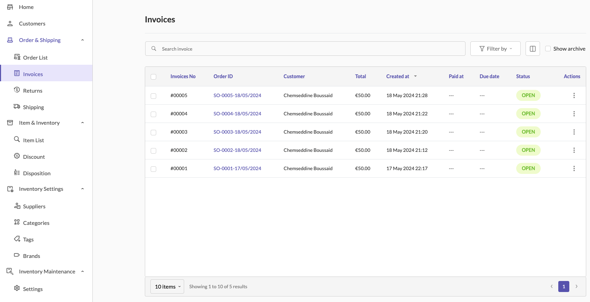
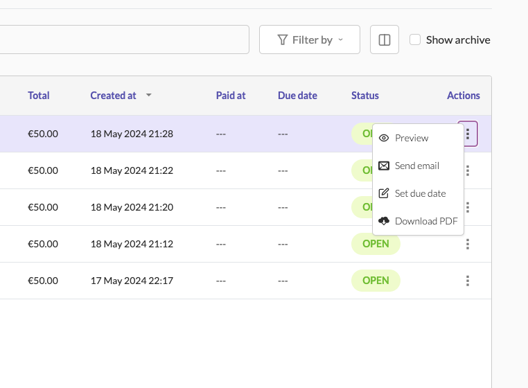
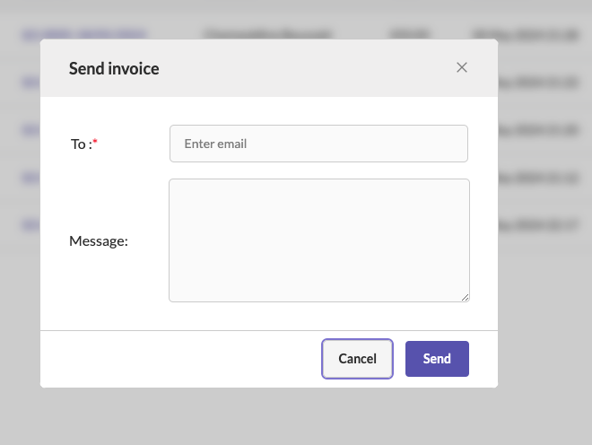
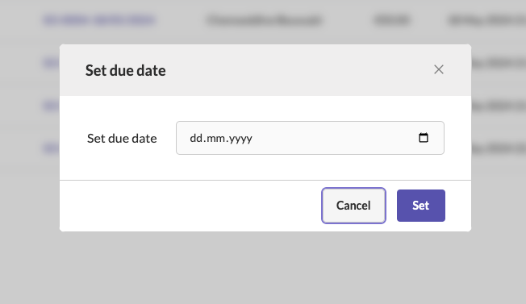
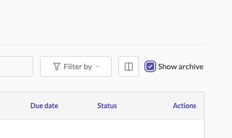

# Managing Invoices

### Overview

> Invoices are essential documents that provide a detailed record of a transaction between a buyer and a seller. They include information about the products or services provided, the amount due, and the terms of payment. In Sellista, the "Invoices" section allows you to manage all your invoices efficiently. You can view, send, set due dates, and download invoices, ensuring smooth financial operations and clear communication with your customers.

### Accessing Invoices

To access the invoices section:

1. Navigate to the **Order & Shipping** menu in the Sellista dashboard.
2. Select **Invoices** to view all your invoices.

The invoice list displays key details such as invoice number, order ID, customer, total amount, creation date, payment status, due date, and actions.

### Viewing and Managing Invoices

1. **Preview Invoice:** To preview an invoice, click the three dots in the **Actions** column of the invoice you want to view and select **Preview.** This will open a detailed view of the invoice, including all relevant information.

2. **Send Invoice via Email:** To send an invoice to a customer via email:

    - Click the three dots in the **Actions** column of the invoice.
    - Select **Send email.**
    - Enter the recipient's email address and add a personalized message if needed.
    - Click **Send** to email the invoice to the customer.

3. **Set Due Date:** To set or update the due date of an invoice:

    - Click the three dots in the "Actions" column of the invoice.
    - Select **Set due date.**
    - Enter the desired due date in the provided field.
    - Click **Set** to save the due date.

4. **Download PDF:** To download a PDF copy of an invoice:

    - Click the three dots in the **Actions** column of the invoice.
    - Select **Download PDF.** The invoice will be downloaded in PDF format, which you can save or print for your records.

### Automatic Invoice Creation

When an order is created and saved in Sellista, a new invoice is automatically generated and added to the **Invoices** section. This ensures that each order has a corresponding invoice for record-keeping and customer reference.

### Search and Filter Invoices

To streamline the management of invoices, Sellista provides search and filter functionalities:

1. **Search:** Use the search bar at the top of the invoices page to quickly find a specific invoice by entering keywords related to the invoice number, order ID, or customer name.
2. **Filter:** Use the filter options to narrow down the invoice list based on specific criteria, such as date range, payment status, or due date.

### Archiving Invoices

To keep your invoice list organized, you can archive invoices that are no longer active or needed in the main view. To view archived invoices, check the "Show archive" option at the top right of the invoices page.

> By following these steps, you can efficiently manage invoices in Sellista, ensuring that all financial transactions are accurately recorded and communicated to customers. This streamlined invoicing process helps improve the efficiency of your e-commerce operations, leading to better customer satisfaction and business growth.