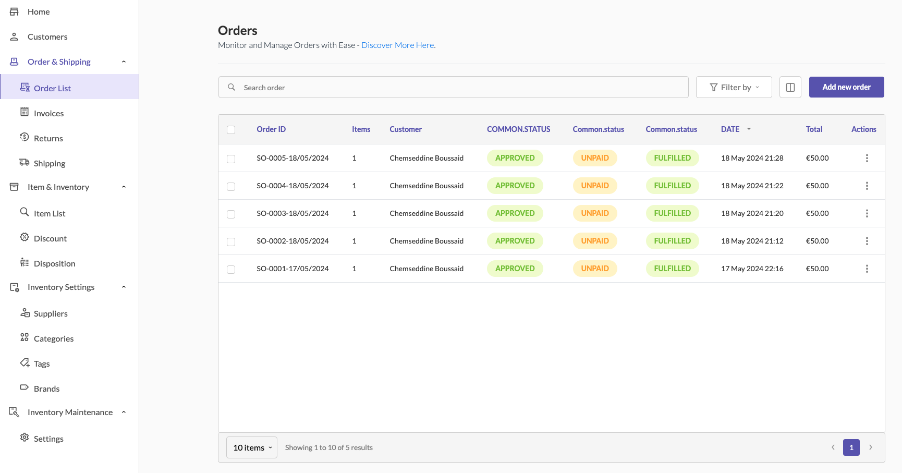

# Managing Orders

### Overview

> Managing orders efficiently is crucial for any e-commerce business. In Sellista, the "Orders" section allows you to monitor and manage all your orders with ease. You can add new orders, assign products to orders, manage customer information, apply discounts, and calculate shipping costs—all from a centralized location. Below is a comprehensive guide on how to manage orders in Sellista.

### Accessing Orders

To access the orders section:

1. Navigate to the **Order & Shipping** menu in the Sellista dashboard.
2. Select **Order List** to view all your orders.

The order list displays key details such as order ID, items, customer, status, date, total amount, and actions.

### Adding a New Order

To add a new order:

1. Click the **Add new order** button at the top right corner of the order list page.
2. A modal window will appear for adding the order details.

### Adding Customer Details

Customers can be added to an order manually or automatically:

1. **Manual Addition:** In the **Customer details** section of the new order modal, search for an existing customer using the search bar. If the customer does not exist, click **+ New Customer** to add a new customer. Fill in the customer's information, including first name, last name, company (optional), email, phone number, and address details. Click "Save" to add the customer.
2. **Automatic Creation:** When a customer makes a purchase from your website or any connected sales channel, their information is automatically captured, and a customer profile is created. The order is then automatically added to the **Order List** in Sellista.

### Adding Products to an Order

To add products to an order:

1. In the **Items** section of the new order modal, click **Add new** to select a product.
2. Search for the product you want to add.
3. Select the product and click **Save.**
4. Specify the quantity, unit price, tax rate, and discount if applicable.
5. The product will be added to the order list with its details.

### Applying Discounts

To apply a discount to an order:

1. In the **Payment** section, click **Add custom discount.**
2. Select the discount type (e.g., amount or percentage).
3. Enter the discount value and a note if needed.
4. Click **Save** to apply the discount.

### Adding Shipping Details

To add shipping details:

1. In the **Payment** section, click **Add shipping cost.**
2. Enter the shipping cost.
3. Click **Save** to add the shipping cost to the order total.

### Setting Payment Status

To set the payment status of an order:

1. Click the three dots in the **Actions** column of the order you want to update.
2. Select **Set payment status.**
3. Choose the appropriate payment status (e.g., partially paid, paid).
4. Click **Save** to update the status.

### Setting Fulfillment Status

To set the fulfillment status of an order:

1. Click the three dots in the **Actions** column of the order you want to update.
2. Select **Set fulfillment status.**
3. Choose the appropriate fulfillment status (e.g., fulfilled, unfulfilled).
4. Click **Save** to update the status.

### Finalizing and Saving the Order

After adding all necessary details (customer, products, discounts, and shipping):

1. Review the order summary in the new order modal.
2. Click **Save** to finalize and create the order.

### Automatic Invoice Creation

When an order is created and saved in Sellista, a new invoice is automatically generated and added to the "Invoices" section. This ensures that each order has a corresponding invoice for record-keeping and customer reference. (We will cover the **Invoices** section in detail later.)

> By following these steps, you can efficiently manage orders in Sellista, ensuring that all customer and product information is accurately recorded and that any applicable discounts, shipping costs, and statuses are included. This streamlined order management process helps improve the efficiency of your e-commerce operations, leading to better customer satisfaction and business growth. Additionally, the automatic creation of orders and customer profiles from your sales channels further simplifies order management and ensures all purchases are tracked seamlessly.

