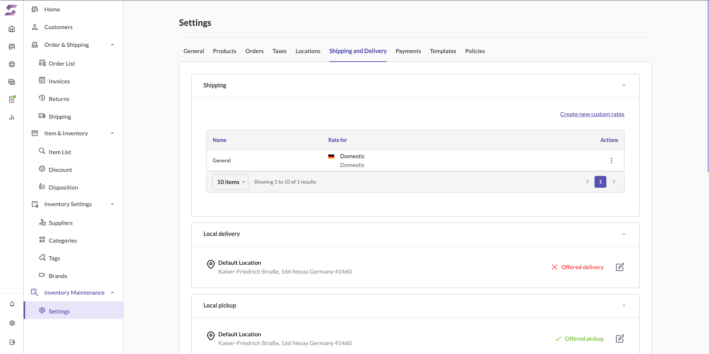
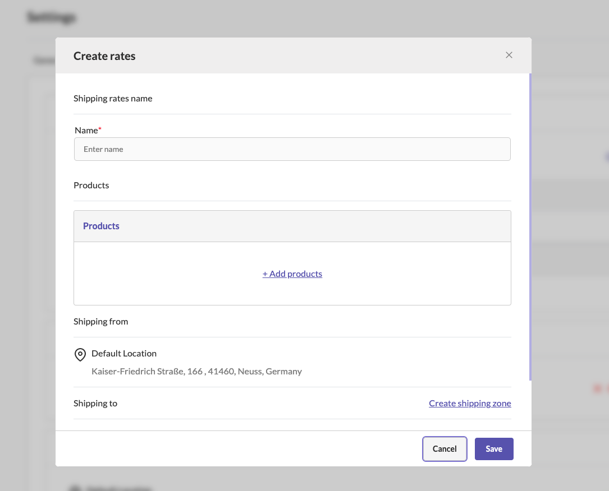
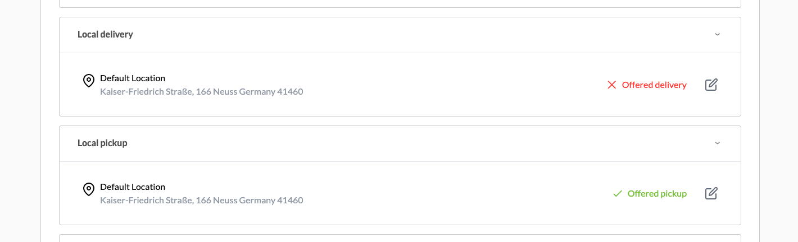
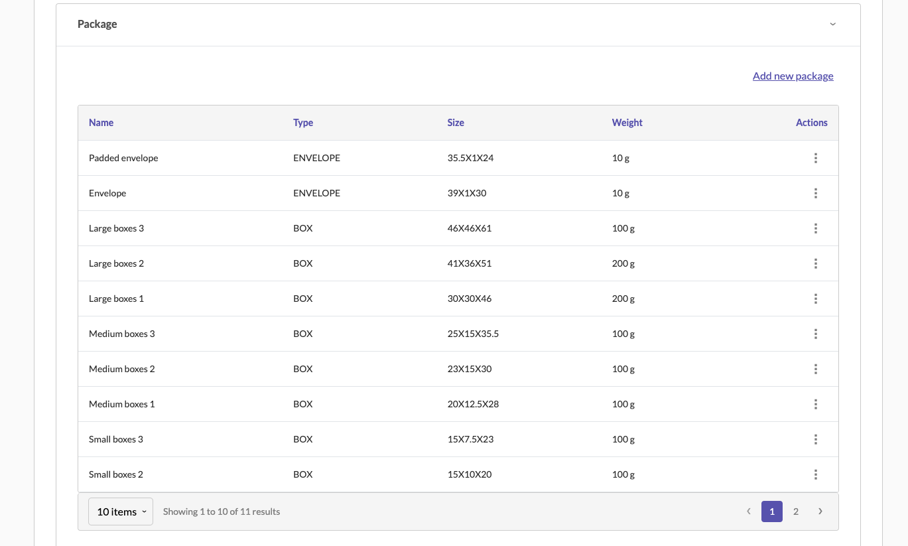
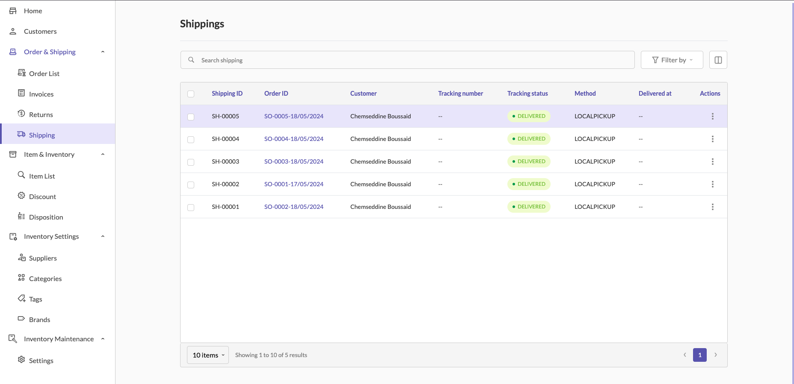

# Shipping Documentation

### Overview

> Shipping in Sellista allows store owners to define shipping rates, carriers, and manage the delivery process for their products. To utilize the shipping feature, users must first configure shipping settings, including rates and carriers.

### Configuring Shipping Settings

1. **Accessing Shipping Settings**

    - Navigate to the sidebar and click on **Order & Shipping**.
    - Select **Shipping** from the submenu.

2. **Defining Shipping Rates and Carriers**

    - In the **Shipping** settings, you can create and manage different shipping rates for your store.
    - To create a new shipping rate:
        - Click on **Create new custom rates**.
        - Fill in the **Shipping rate name** and specify the products this rate applies to.
        - Set the **Shipping from** location and the **Shipping to** zones.
        - Save the new shipping rate.

        
        
3. **Local Delivery and Pickup Options**

    - **Local Delivery:**
        - You can manage local delivery settings by editing the default location.
        - Enable local delivery by checking the Local **delivery offered** option.
        - Save the changes.
    - **Local Pickup:**
        - Manage local pickup settings similarly by editing the default location.
        - Enable local pickup by checking the **Local pickup offered** option.
        - Specify the expected pickup time and add any pickup instructions.
        - Save the changes.

        

4. **Managing Packages**

    - Under the **Package** section, you can define the types of packages you use for shipping.
    - Click on **Add new package** to add different types, sizes, and weights of packages.
    - Save the package details.

### Shipping Orders

1. **Shipping Orders List**

    - Navigate to **Order & Shipping** and select **Shipping**.
    - Here, you will see a list of all shipping orders, including their ID, customer, tracking number, status, and method.

2. **Setting Tracking Status**

   - To update the tracking status of an order, click on the **Set tracking status** option next to the order.
   - Select the appropriate tracking status from the dropdown menu and add any necessary notes.
   - Save the status update.

